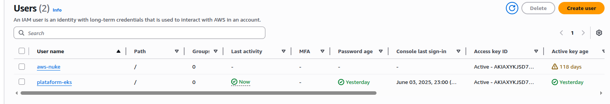
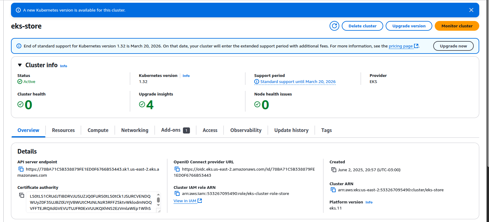
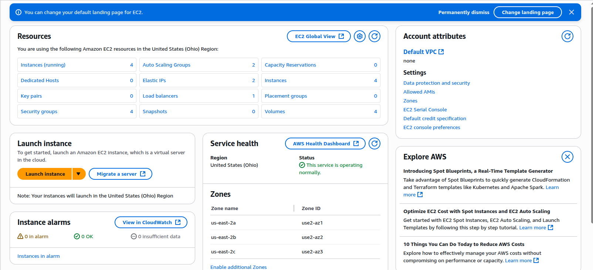
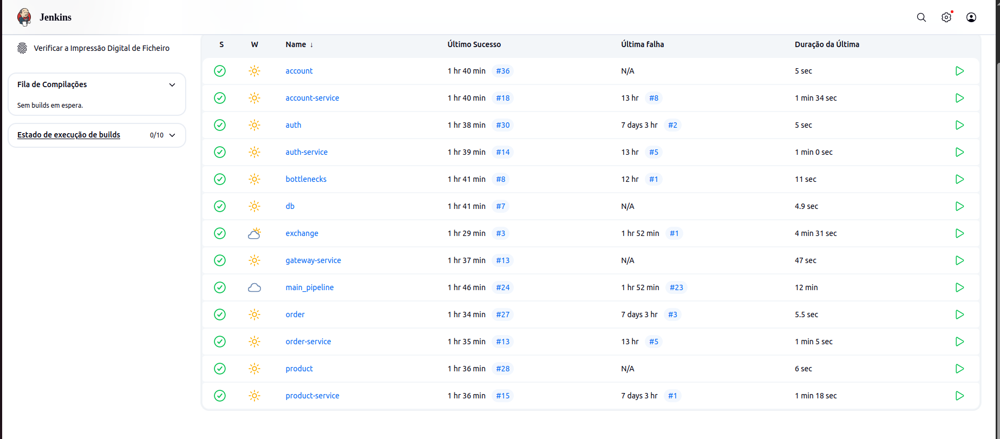

# Team Project

## Configuração AWS

A AWS é uma plataforma de computação em nuvem que oferece uma ampla gama de serviços, incluindo computação, armazenamento, banco de dados, análise, rede, mobilidade, ferramentas de desenvolvedor, gerenciamento e segurança.

Para configurar a AWS, foi criado um usuário com *AdministradorAcess* chamado *platform-eks*.



## Configuração EKS

O Amazon Elastic Kubernetes Service (EKS) é um serviço gerenciado que facilita a execução do Kubernetes na AWS sem a necessidade de instalar e operar seu próprio plano de controle ou nós de trabalho do Kubernetes. O EKS cuida da alta disponibilidade e escalabilidade do plano de controle do Kubernetes, permitindo que você se concentre em implantar e gerenciar seus aplicativos.

Para isso, criamos um EKS Cluster.





## Testes de Carga 

Os testes de carga são uma parte importante do desenvolvimento de software, pois ajudam a garantir que sua aplicação possa lidar com o tráfego esperado. 

[Teste de Carga](youtube)

## CI/CD

A integração contínua (CI) e a entrega contínua (CD) são práticas de desenvolvimento de software que ajudam a garantir que seu código esteja sempre em um estado implantável. Utilizamos o Jenkins para implementá-las. 



Para isso, foi realizado uma série de etapas para a configuração do Jenkins:

1. Instalação do MiniKube;
1. Instalação do AWS CLI;
1. Configurar o kube-config para apontar para o cluster remoto AWS EKS.

Além disso, cada um dos microsserviços possuem um arquivo Jenkinsfile na raiz do projeto, como abaixo:

``` { .bash }
.
├── account-service
│   ├── Jenkinsfile
│   └── ...
```

O código-fonte do arquivo Jekinsfile pode ser visto abaixo:

=== "Interface"
    ``` { .java .copy .select linenums="1" }
    --8<-- "https://raw.githubusercontent.com/mmp052/account/main/Jenkinsfile"
    ```

=== "Implementação"
    ``` { .groovy .copy .select linenums="1" }
    --8<-- "https://raw.githubusercontent.com/mmp052/account-service/main/Jenkinsfile"
    ```

## Análise de Custo

A análise de custos é uma parte importante do desenvolvimento de software, já que ajuda a garantir que o projeto esteja dentro do orçamento.

[Análise de Custo](custos)

## PaaS

Com o modelo de Plataforma como Serviço (PaaS), é possível executar e administrar aplicações sem a necessidade de lidar com toda a complexidade de configurar e manter a infraestrutura subjacente. No nosso projeto, utilizamos a AWS por meio do serviço Amazon EKS (Elastic Kubernetes Service), o que nos possibilitou rodar containers em larga escala sem nos preocuparmos com o provisionamento ou gerenciamento manual de servidores ou clusters.

Essa estratégia nos trouxe diversos benefícios:

Permitiu que a equipe focasse exclusivamente no desenvolvimento da aplicação, sem se preocupar com a configuração da infraestrutura.

Facilitou a automação dos processos de deploy e escalabilidade, permitindo que o sistema se ajuste dinamicamente conforme a demanda.

Aumentou a produtividade, já que tarefas como atualizações, disponibilidade e gerenciamento de servidores ficam sob responsabilidade da própria plataforma.

Além disso, nosso objetivo a longo prazo é evoluir a solução para um modelo completo de PaaS, no qual o sistema poderá ser disponibilizado diretamente aos usuários como um serviço. Assim, os clientes não precisarão instalar ou manter nenhuma infraestrutura local — bastará acessar a aplicação pela internet, de forma semelhante às soluções SaaS (Software como Serviço).